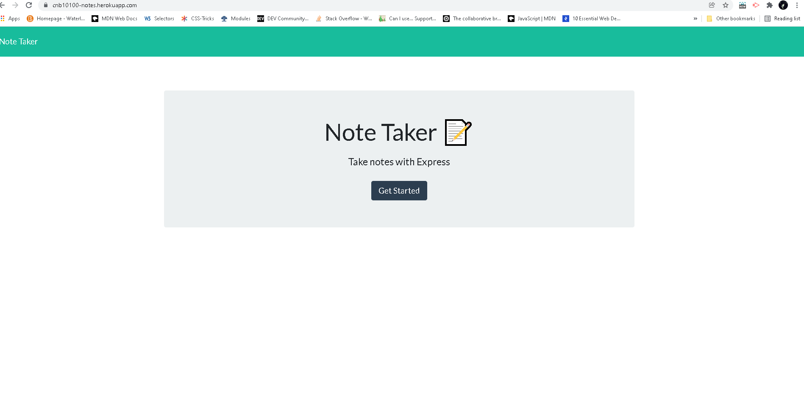
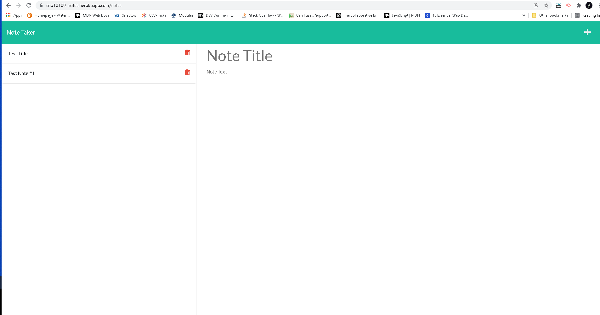

# Note-taker

## Description

An application that allows the user to create and store notes, a productivity app.

## Installation

To use this application, you can just visit the deployed application link at https://cnb10100-notes.herokuapp.com/.

If you would like to further development on this application, feel free to clone the repository code. 

## Usage

After cloning the repo, you must install the following packages using npm:

- Express
- uuid

## Built With

- Node.js
- Javascript
- Express.js
- CSS
- HTML

## Application Screenshots

